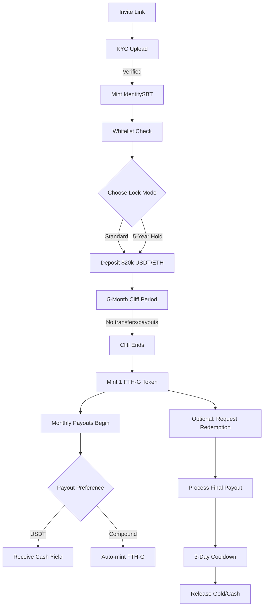

# FTH-GOLD Private Placement System (Dubai)

**Dubai-Licensed Gold Token Program**  
Future Tech Holdings – Private Placement Module

---

## 🎯 TL;DR (Executive Summary)

- **Entry:** $20,000 per 1kg gold token (FTH-G)
- **Lock:** 5-month cliff (no transfers/payouts), optional 5-year hold commitment
- **Yield:** 5-10% monthly USDT payouts post-cliff (floating rate based on mining performance)
- **Backing:** NI 43-101 verified gold mines, 1:1 reserve coverage, Dubai DMCC licensed
- **Scale:** 100,000 units target (100 metric tons → $2B raise)
- **Rails:** USDT-ETH, USDT-TRON, ETH, with optional wGOLD-USDT labeling

---

## 📋 System Overview

```
Entry: $20,000 → 5-month cliff → 1 FTH-G token (1kg) → 5-10% monthly yield
```

### Core Features
- **Invite-only** platform with KYC/passport verification
- **Smart contract** enforcement of lock periods and payouts
- **Proof of Reserves** via Chainlink oracles + auditor attestations
- **Multi-chain support** with USDT bridge normalization
- **Compliance framework** for Dubai/UAE jurisdiction

---

## 🏗️ Architecture

```
contracts/
  core/
    FTHG.sol                 # ERC-20 gold token (1 token = 1kg)
    SubscriptionPool.sol     # $20k entry point with lock mode selection
    LockVault.sol            # 5-month cliff enforcement + 5-year hold option
    PayoutController.sol     # Floating 5-10% monthly distributions
    RedemptionDesk.sol       # Gold redemption with payout-before-withdraw
  compliance/
    IdentitySBT.sol         # KYC soulbound NFT
    ComplianceRegistry.sol   # Sanctions screening + jurisdiction flags
    WhitelistGate.sol       # Invite-only access control
  proof/
    ProofOfGold.sol         # IPFS-anchored NI 43-101 + vault receipts
    ReserveOracle.sol       # Coverage ratio monitoring (≥100%)
    PayoutRateOracle.sol    # Dynamic rate based on mining performance
  rails/
    GatewayRouter.sol       # USDT-TRON bridge normalization
    StablecoinWrapper.sol   # ETH auto-wrapping
    wGOLDUSDT.sol          # Optional vault-specific labeling token
  mgmt/
    FeeTreasury.sol        # Protocol fee collection
    CircuitBreaker.sol     # Emergency pause on coverage breach
    AdminMultiSig.sol      # 2-of-N operations control
```

---

## 📊 Token Economics

- **Supply Cap:** 100,000 FTH-G (100 metric tons)
- **Entry Price:** $20,000 per token (fixed private placement rate)
- **Monthly Yield:** 5-10% of entry price ($1,000-$2,000 per token)
- **5-Year Gross:** $60k-$120k + compounding potential per $20k entry
- **Reserve Ratio:** Maintain ≥100% kg coverage (monitored real-time)

---

## 🔄 User Flow



---

## 🛡️ Compliance & Risk Management

### Dubai Licensing
- **DMCC Gold Trading License** (or DIFC/ADGM equivalent)
- Private placement exemptions under UAE securities law
- Clear redemption rights (1 token = 1kg gold subject to fees)

### Asset Verification
- **NI 43-101 Technical Reports** for all mine partners
- Monthly vault reconciliation with bar lists + assays
- **Chainlink Proof of Reserves** + independent auditor attestations
- IPFS-anchored evidence trail for transparency

### KYC/AML Controls
- Mandatory passport upload + identity verification
- Sanctions screening against OFAC/UN/EU lists
- PEP and adverse media flagging
- Travel Rule compliance for large payouts

### Risk Controls
- **Coverage Circuit Breaker:** Auto-pause if reserves drop below 100%
- **Rate Guardrails:** 5-10% monthly payout caps with smoothing
- **Oracle Resilience:** 2-of-N data sources with medianizer
- **Emergency Pause:** Multi-sig controlled system halts

---

## ⚙️ Technical Implementation

### Smart Contract Stack
- **Solidity 0.8.26** with Foundry testing framework
- **ERC-20** for FTH-G token with mint restrictions
- **ERC-721** soulbound NFTs for identity verification
- **Multi-signature** controls for all admin functions

### Supported Networks
- **Ethereum Mainnet/Sepolia** (primary)
- **Polygon** (optional scaling)
- **TRON bridge** via GatewayRouter for USDT deposits

### Oracle Integration
- **Chainlink Proof of Reserves** feeds
- **Custom mining performance** oracles for rate setting
- **Price feeds** for multi-asset deposit normalization

---

## 📈 Mining Performance Metrics

### Payout Rate Calculation
- **Base Rate:** Mining production per kg issued
- **Performance Modifiers:** Refinery sales, hedging P/L, operational costs
- **Coverage Margin:** Reserve buffer maintenance
- **Smoothing:** EMA-based rate changes (max ±100 bps per epoch)

### Transparency Dashboard
- Real-time coverage ratio display
- Monthly production reports
- Payout history and projections
- Mine-by-mine performance metrics

---

## 🚀 Deployment Guide

### Prerequisites
```bash
# Install Foundry
curl -L https://foundry.paradigm.xyz | bash
foundryup

# Clone and setup
git clone git@github.com:kevanbtc/FuturetechGold.git
cd FuturetechGold
forge install
```

### Configuration
```bash
# Copy environment template
cp .env.example .env

# Edit with your values:
# USDT_ADDRESS=0x...
# MULTISIG_ADDRESS=0x...
# ORACLE_SIGNER=0x...
```

### Deploy to Testnet
```bash
# Deploy all contracts
forge script script/Deploy.s.sol --rpc-url sepolia --broadcast

# Seed with Dubai parameters
forge script script/SeedDubai.s.sol --rpc-url sepolia --broadcast

# Verify contracts
forge verify-contract <address> <contract> --chain sepolia
```

---

## 📚 Documentation Index

- [📋 **Complete System Spec**](docs/SYSTEM-ARCHITECTURE.md)
- [⚖️ **Compliance Framework**](docs/COMPLIANCE-DUBAI.md)  
- [🔐 **Risk Management**](docs/RISK-POLICY.md)
- [⚡ **Operations Runbook**](docs/OPERATIONS-RUNBOOK.md)
- [🔍 **Oracle Specifications**](docs/ORACLE-SPEC.md)
- [📊 **Audit Trail Format**](docs/AUDIT-TRAIL.md)
- [🧪 **Testing Guide**](docs/TESTING.md)

---

## 📞 Support & Contact

- **Technical Issues:** Create GitHub issue with reproduction steps
- **Business Inquiries:** Contact via Dubai office (license details in compliance docs)
- **Security Concerns:** security@futuretechholdings.com (GPG key available)

---

**⚠️ Important Notice**  
This is a private placement offering available only to invited participants. Tokens represent contractual rights to gold delivery subject to terms and conditions. Past performance does not guarantee future results. All investments carry risk of loss.

---

*Built with ❤️ by Future Tech Holdings • Licensed under MIT • Dubai DMCC Regulated*