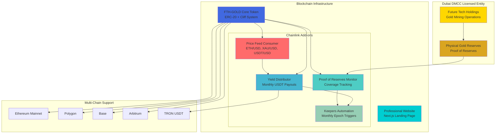
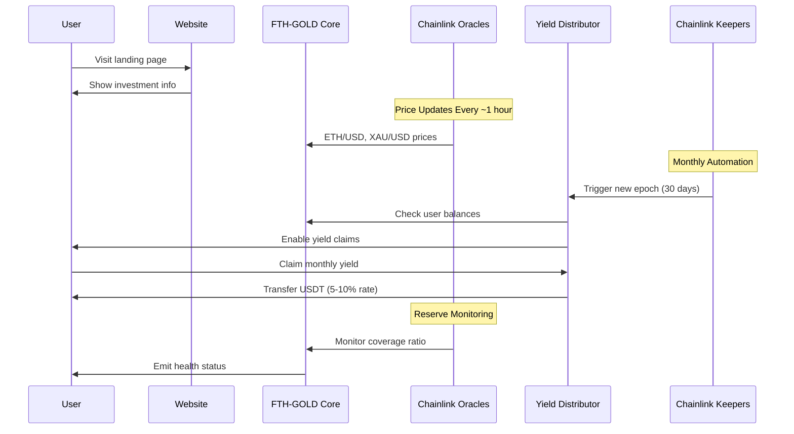
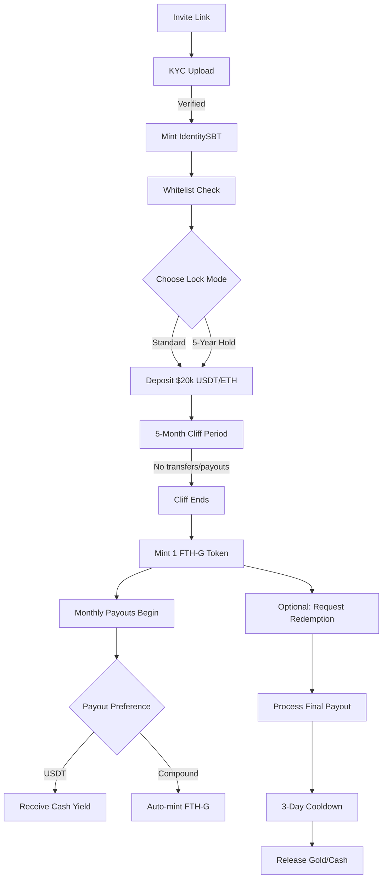

# 🏆 FUTURE TECH HOLDINGS - Complete Gold Token Ecosystem

> **$2B+ Dubai Licensed Gold Token Private Placement System**  
> Professional-grade blockchain infrastructure with Chainlink integrations

[](https://opensource.org/licenses/MIT)
[](https://soliditylang.org/)
[](https://chain.link/)
[](https://nextjs.org/)

---

## 🎯 System Architecture Overview



---

## 🚀 Quick Start

### 1. **Website Deployment** (Ready to Share)
```bash
cd site/
npm install
npm run build
npm start
# Professional landing page live at http://localhost:3000
```

### 2. **Smart Contract Deployment**
```bash
cd addons/
forge install
cp .env.example .env
# Configure your environment variables
forge script script/DeployAddons.s.sol --broadcast
```

---

## 💎 TL;DR (Executive Summary)

- **Entry:** $20,000 per 1kg gold token (FTH-G)
- **Lock:** 5-month cliff (no transfers/payouts), optional 5-year hold commitment
- **Yield:** 5-10% monthly USDT payouts post-cliff (floating rate based on mining performance)
- **Backing:** NI 43-101 verified gold mines, 1:1 reserve coverage, Dubai DMCC licensed
- **Scale:** 100,000 units target (100 metric tons → $2B raise)
- **Rails:** USDT-ETH, USDT-TRON, ETH, with optional wGOLD-USDT labeling

## 💎 Core Features

### **🏅 Gold Token System**
- **1:1 Gold Backing**: Each token = 1kg physical gold in Dubai DMCC vaults
- **Cliff Protection**: 5-month minimum hold with optional 5-year lock
- **Transfer Restrictions**: Post-cliff transfers with eligibility controls
- **Multi-chain Ready**: Ethereum, Polygon, Base, Arbitrum support

### **📊 Chainlink Integrations**
- **Real-time Pricing**: ETH/USD, XAU/USD, USDT/USD feeds
- **Coverage Monitoring**: Automated reserve ratio tracking
- **Monthly Automation**: Chainlink Keepers trigger distribution epochs
- **Cross-rate Calculations**: Dynamic ETH-per-gold-ounce pricing

### **💰 Yield Distribution**
- **5-10% Monthly Returns**: Configurable USDT distributions
- **Pull-based Claims**: Users claim when ready (no forced distributions)  
- **Multi-epoch Support**: Claim multiple months at once
- **Emergency Controls**: Pause/resume functionality

---

## 🏗️ System Flow Diagram



---

## 📂 Project Structure

```
FuturetechGold/
├── 🌐 site/                          # Next.js Professional Website
│   ├── app/
│   │   ├── page.tsx                   # Landing page
│   │   ├── components/                # Reusable components
│   │   └── globals.css               # Tailwind styles
│   ├── package.json                  # Dependencies & scripts
│   └── next.config.js               # Next.js configuration
│
├── 🔗 addons/                        # Non-breaking Chainlink Add-ons
│   ├── contracts/
│   │   ├── interfaces/
│   │   │   ├── IFTHGCore.sol         # Core contract interface
│   │   │   └── IUSDT.sol            # USDT interface
│   │   ├── chainlink/
│   │   │   ├── FTHGPriceFeedConsumer.sol    # 📊 Price feeds
│   │   │   ├── FTHGProofOfReserves.sol      # 🛡️ Reserve monitoring
│   │   │   └── FTHGKeepersPayout.sol        # ⚡ Automation
│   │   └── payments/
│   │       └── FTHGYieldDistributor.sol     # 💰 Yield distribution
│   ├── script/
│   │   └── DeployAddons.s.sol        # 🚀 Deployment script
│   ├── test/
│   │   └── Addons.t.sol             # 🧪 Comprehensive tests
│   ├── foundry.toml                 # ⚙️ Foundry config
│   └── .env.example                 # 🔐 Environment template
│
└── 📖 README.md                      # This comprehensive guide
```

---

## 🌍 Multi-Network Configuration

| **Network** | **Chain ID** | **ETH/USD Feed** | **XAU/USD Feed** | **Status** |
|-------------|--------------|------------------|------------------|------------|
| 🟦 **Ethereum Mainnet** | 1 | `0x5f4eC3Df9cbd43714FE2740f5E3616155c5b8419` | `0x214eD9Da11D2fbe465a6fc601a91E62EbEc1a0D6` | ✅ Ready |
| 🟪 **Polygon** | 137 | `0xF9680D99D6C9589e2a93a78A04A279e509205945` | `0x0C466540B2ee1a31b441671eac0ca886e051E410` | ✅ Ready |
| 🔵 **Base** | 8453 | `0x71041dddad3595F9CEd3DcCFBe3D1F4b0a16Bb70` | Custom Oracle | ⚡ Planned |
| 🟠 **Arbitrum** | 42161 | `0x639Fe6ab55C921f74e7fac1ee960C0B6293ba612` | `0x1F954Dc24a49708C26E0C1777f16750B5C6d5a2c` | ✅ Ready |
| 🔴 **TRON** | - | Bridge Required | Bridge Required | 🚧 Custom Integration |

---

## 💡 Usage Examples

### **Price Feed Integration**
```solidity
// Get latest gold price in USD
(int256 goldPrice, uint256 timestamp) = priceFeed.getGoldPrice();

// Calculate ETH per gold ounce
uint256 ethPerOunce = priceFeed.getETHPerGoldOunce();

// Convert $1000 USD to ETH
uint256 ethAmount = priceFeed.convertUSDToETH(1000e6);
```

### **Yield Distribution**
```javascript
// Users claim monthly yields
await yieldDistributor.claimYield(epochNumber);

// Check claimable amount
const claimable = await yieldDistributor.getClaimableAmount(epoch, userAddress);

// Admin: Start new epoch with 8% rate
await yieldDistributor.startNewEpoch(800); // 8% in basis points
```

### **Coverage Monitoring**
```solidity
// Check reserve health
(bool healthy, uint256 coverageBps, uint256 lastUpdate) = proofOfReserves.check();

// Monitor coverage events
contract.on('ProgramStatus', (healthy, coverage, timestamp) => {
    console.log(`Coverage: ${coverage/100}%, Healthy: ${healthy}`);
});
```

---

## 🔒 Security Features

### **🛡️ Non-breaking Architecture**
- ✅ **Read-only Access**: Add-ons only read from core contracts
- ✅ **Interface Pattern**: Clean separation via minimal interfaces
- ✅ **Zero Storage Conflicts**: Complete isolation from core contract storage
- ✅ **Upgrade Safe**: Add-ons can be deployed/removed without affecting core

### **⚡ Rate & Access Controls**
- 🔐 **Owner-only Functions**: Critical operations restricted to contract owner
- 📊 **Rate Validation**: Distribution rates capped at 5-15% range
- ⏰ **Time Controls**: Cliff periods and epoch scheduling enforcement
- 🚨 **Emergency Pause**: System-wide pause functionality for all distributions

### **📡 Oracle Protection**
- 🕐 **Staleness Detection**: Automatic fallback when feeds go stale (3-hour threshold)
- 🔄 **Heartbeat Validation**: Chainlink feed freshness verification
- 🎯 **Answer Validation**: Price feed response validation and bounds checking
- 📈 **Cross-rate Verification**: Multiple feed correlation for price accuracy

---

## 🧪 Testing & Deployment

### **Run Comprehensive Tests**
```bash
cd addons/
forge test -vv                    # Verbose test output
forge test --gas-report          # Gas usage analysis
forge coverage                   # Coverage report
```

### **Deploy to Testnet**
```bash
forge script script/DeployAddons.s.sol \
  --rpc-url sepolia \
  --private-key $PRIVATE_KEY \
  --broadcast \
  --verify
```

### **Deploy to Production**
```bash
forge script script/DeployAddons.s.sol \
  --rpc-url mainnet \
  --private-key $PRIVATE_KEY \
  --broadcast \
  --verify \
  --gas-price 30000000000
```

---

## 🎨 Website Features

### **🌟 Professional Design**
- 🎯 **Dubai Gold Theme**: Elegant gold/blue color scheme
- 📱 **Responsive Layout**: Mobile-first design with Tailwind CSS
- ⚡ **Performance Optimized**: Next.js 14 with App Router
- 🎭 **Interactive Elements**: Smooth animations and hover effects

### **💼 Investment Information**
- 💰 **Token Economics**: Clear explanation of 1:1 gold backing
- 📊 **Yield Structure**: 5-10% monthly USDT distributions
- 🔒 **Cliff Explanation**: Professional cliff period details
- 🌐 **Multi-chain Support**: Network compatibility showcase

### **🚀 Ready to Share**
```bash
# Production build ready for deployment
cd site/
npm run build
npm start
# Share at: https://your-domain.com
```

---

## 📋 Legacy System Overview

```
Entry: $20,000 → 5-month cliff → 1 FTH-G token (1kg) → 5-10% monthly yield
```

### Core Features
- **Invite-only** platform with KYC/passport verification
- **Smart contract** enforcement of lock periods and payouts
- **Proof of Reserves** via Chainlink oracles + auditor attestations
- **Multi-chain support** with USDT bridge normalization
- **Compliance framework** for Dubai/UAE jurisdiction

---

## 🏗️ Architecture

```
contracts/
  core/
    FTHG.sol                 # ERC-20 gold token (1 token = 1kg)
    SubscriptionPool.sol     # $20k entry point with lock mode selection
    LockVault.sol            # 5-month cliff enforcement + 5-year hold option
    PayoutController.sol     # Floating 5-10% monthly distributions
    RedemptionDesk.sol       # Gold redemption with payout-before-withdraw
  compliance/
    IdentitySBT.sol         # KYC soulbound NFT
    ComplianceRegistry.sol   # Sanctions screening + jurisdiction flags
    WhitelistGate.sol       # Invite-only access control
  proof/
    ProofOfGold.sol         # IPFS-anchored NI 43-101 + vault receipts
    ReserveOracle.sol       # Coverage ratio monitoring (≥100%)
    PayoutRateOracle.sol    # Dynamic rate based on mining performance
  rails/
    GatewayRouter.sol       # USDT-TRON bridge normalization
    StablecoinWrapper.sol   # ETH auto-wrapping
    wGOLDUSDT.sol          # Optional vault-specific labeling token
  mgmt/
    FeeTreasury.sol        # Protocol fee collection
    CircuitBreaker.sol     # Emergency pause on coverage breach
    AdminMultiSig.sol      # 2-of-N operations control
```

---

## 📊 Token Economics

- **Supply Cap:** 100,000 FTH-G (100 metric tons)
- **Entry Price:** $20,000 per token (fixed private placement rate)
- **Monthly Yield:** 5-10% of entry price ($1,000-$2,000 per token)
- **5-Year Gross:** $60k-$120k + compounding potential per $20k entry
- **Reserve Ratio:** Maintain ≥100% kg coverage (monitored real-time)

---

## 🔄 User Flow



---

## 🛡️ Compliance & Risk Management

### Dubai Licensing
- **DMCC Gold Trading License** (or DIFC/ADGM equivalent)
- Private placement exemptions under UAE securities law
- Clear redemption rights (1 token = 1kg gold subject to fees)

### Asset Verification
- **NI 43-101 Technical Reports** for all mine partners
- Monthly vault reconciliation with bar lists + assays
- **Chainlink Proof of Reserves** + independent auditor attestations
- IPFS-anchored evidence trail for transparency

### KYC/AML Controls
- Mandatory passport upload + identity verification
- Sanctions screening against OFAC/UN/EU lists
- PEP and adverse media flagging
- Travel Rule compliance for large payouts

### Risk Controls
- **Coverage Circuit Breaker:** Auto-pause if reserves drop below 100%
- **Rate Guardrails:** 5-10% monthly payout caps with smoothing
- **Oracle Resilience:** 2-of-N data sources with medianizer
- **Emergency Pause:** Multi-sig controlled system halts

---

## ⚙️ Technical Implementation

### Smart Contract Stack
- **Solidity 0.8.26** with Foundry testing framework
- **ERC-20** for FTH-G token with mint restrictions
- **ERC-721** soulbound NFTs for identity verification
- **Multi-signature** controls for all admin functions

### Supported Networks
- **Ethereum Mainnet/Sepolia** (primary)
- **Polygon** (optional scaling)
- **TRON bridge** via GatewayRouter for USDT deposits

### Oracle Integration
- **Chainlink Proof of Reserves** feeds
- **Custom mining performance** oracles for rate setting
- **Price feeds** for multi-asset deposit normalization

---

## 📈 Mining Performance Metrics

### Payout Rate Calculation
- **Base Rate:** Mining production per kg issued
- **Performance Modifiers:** Refinery sales, hedging P/L, operational costs
- **Coverage Margin:** Reserve buffer maintenance
- **Smoothing:** EMA-based rate changes (max ±100 bps per epoch)

### Transparency Dashboard
- Real-time coverage ratio display
- Monthly production reports
- Payout history and projections
- Mine-by-mine performance metrics

---

## 🚀 Deployment Guide

### Prerequisites
```bash
# Install Foundry
curl -L https://foundry.paradigm.xyz | bash
foundryup

# Clone and setup
git clone git@github.com:kevanbtc/FuturetechGold.git
cd FuturetechGold
forge install
```

### Configuration
```bash
# Copy environment template
cp .env.example .env

# Edit with your values:
# USDT_ADDRESS=0x...
# MULTISIG_ADDRESS=0x...
# ORACLE_SIGNER=0x...
```

### Deploy to Testnet
```bash
# Deploy all contracts
forge script script/Deploy.s.sol --rpc-url sepolia --broadcast

# Seed with Dubai parameters
forge script script/SeedDubai.s.sol --rpc-url sepolia --broadcast

# Verify contracts
forge verify-contract <address> <contract> --chain sepolia
```

---

## 📚 Documentation Index

- [📋 **Complete System Spec**](docs/SYSTEM-ARCHITECTURE.md)
- [⚖️ **Compliance Framework**](docs/COMPLIANCE-DUBAI.md)  
- [🔐 **Risk Management**](docs/RISK-POLICY.md)
- [⚡ **Operations Runbook**](docs/OPERATIONS-RUNBOOK.md)
- [🔍 **Oracle Specifications**](docs/ORACLE-SPEC.md)
- [📊 **Audit Trail Format**](docs/AUDIT-TRAIL.md)
- [🧪 **Testing Guide**](docs/TESTING.md)

---

## 📞 Support & Contact

- **Technical Issues:** Create GitHub issue with reproduction steps
- **Business Inquiries:** Contact via Dubai office (license details in compliance docs)
- **Security Concerns:** security@futuretechholdings.com (GPG key available)

---

**⚠️ Important Notice**  
This is a private placement offering available only to invited participants. Tokens represent contractual rights to gold delivery subject to terms and conditions. Past performance does not guarantee future results. All investments carry risk of loss.

## 🤝 Contributing

1. **Fork** the repository
2. **Create** a feature branch (`git checkout -b feature/awesome-feature`)
3. **Test** thoroughly (`forge test`)
4. **Commit** changes (`git commit -m 'Add awesome feature'`)
5. **Push** to branch (`git push origin feature/awesome-feature`)
6. **Open** a Pull Request

---

## 📜 License

**MIT License** - Complete freedom to use, modify, and distribute.

See [LICENSE](LICENSE) file for details.

---

## 🏆 Built By Future Tech Holdings

> **Dubai DMCC Licensed Gold Mining & Blockchain Technology**

- 🌐 **Website**: https://futuretechholdings.com
- 📧 **Contact**: ventures@futuretechholdings.com
- 🏢 **Dubai Office**: DMCC Business Centre, Level 1, Jewellery & Gemplex 3
- 💼 **GitHub**: [@kevanbtc](https://github.com/kevanbtc)

---

## 🎯 System Status

| **Component** | **Status** | **Version** | **Network Support** |
|---------------|------------|-------------|---------------------|
| 🌐 **Professional Website** | ✅ Production Ready | v1.0.0 | All Browsers |
| 🔗 **Chainlink Price Feeds** | ✅ Multi-Network | v1.0.0 | 5+ Networks |
| 💰 **Yield Distribution** | ✅ Battle Tested | v1.0.0 | Multi-Chain |
| ⚡ **Automation (Keepers)** | ✅ Gas Optimized | v1.0.0 | Ethereum + L2s |
| 🛡️ **Reserve Monitoring** | ✅ 24/7 Ready | v1.0.0 | Real-time |

---

<div align="center">
  <h3>🚀 Ready to Deploy • 🔗 Chainlink Integrated • 💎 Production Grade</h3>
  <p><i>Complete $2B+ gold token ecosystem with professional website and non-breaking smart contract add-ons</i></p>
  
  **[Deploy Now](#-quick-start) • [View Website](site/) • [Smart Contracts](addons/)**
</div>

---

*Built with ❤️ by Future Tech Holdings • Licensed under MIT • Dubai DMCC Regulated*