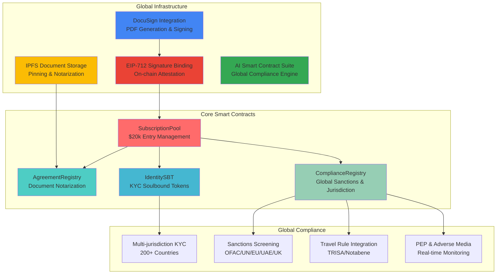
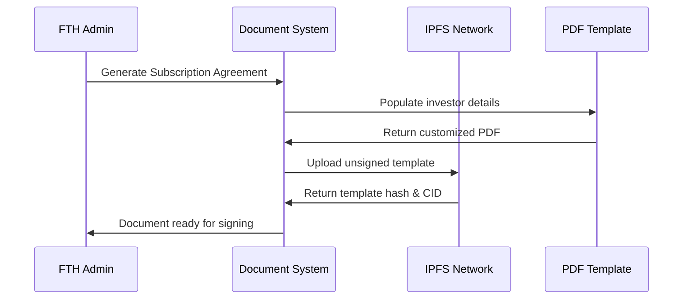
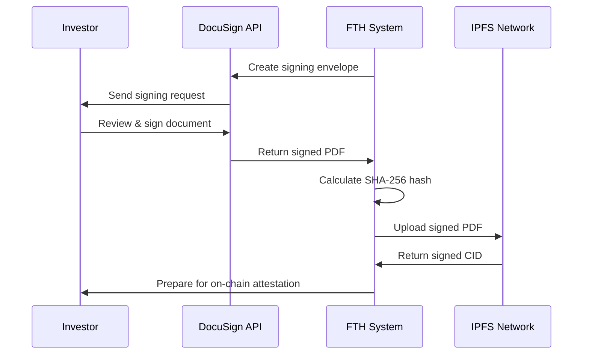
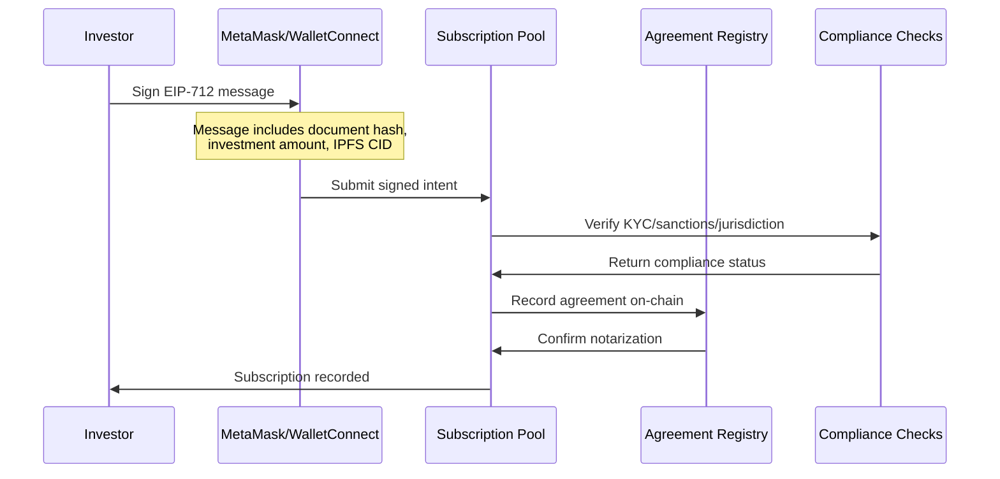
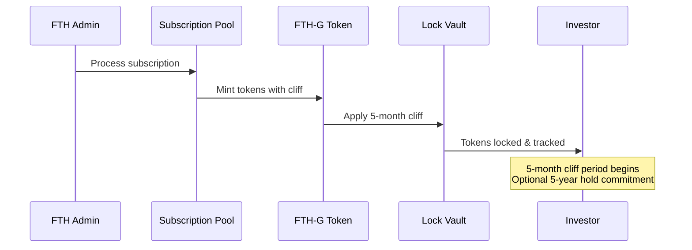

# 🌍 Future Tech Holdings - Global Smart Contract Infrastructure

> **AI DocuSign-Like Global Subscription System**  
> Complete blockchain infrastructure for worldwide document signing and compliance

[](https://opensource.org/licenses/MIT)
[](https://soliditylang.org/)
[](https://github.com/kevanbtc)

---

## 🎯 System Architecture Overview



---

## 🚀 Complete End-to-End Signing Flow

### **Phase 1: Document Preparation**


### **Phase 2: Off-chain Signing (DocuSign)**


### **Phase 3: On-chain Attestation (EIP-712)**


### **Phase 4: Token Minting & Distribution**


---

## 💡 AI DocuSign Integration Features

### **🤖 Smart Document Generation**
```typescript
// Document generation with AI-powered customization
interface DocumentRequest {
    investorName: string;
    investorAddress: string;
    subscriptionAmount: number;
    jurisdiction: string;
    kycLevel: "BASIC" | "ENHANCED" | "INSTITUTIONAL";
    fiveYearHold: boolean;
}

// Generates customized PDF with unique DocID
async function generateSubscriptionAgreement(request: DocumentRequest): Promise<{
    documentId: string;
    pdfBuffer: Buffer;
    documentHash: string;
    templateVersion: string;
}> {
    // AI-powered document customization based on jurisdiction
    const customizedPDF = await generatePDF(request);
    const documentHash = sha256(customizedPDF);
    
    return {
        documentId: generateUniqueDocId(),
        pdfBuffer: customizedPDF,
        documentHash,
        templateVersion: "2025-09-08-v1.0"
    };
}
```

### **🔐 EIP-712 Signature Structure**
```solidity
// EIP-712 typed data for on-chain signature verification
struct SubscriptionIntent {
    address investor;        // Investor wallet address
    uint256 amount;         // Investment amount in USDT/USDC
    bytes32 documentHash;   // SHA-256 hash of signed PDF
    uint256 nonce;          // Anti-replay nonce
    uint256 deadline;       // Signature expiry timestamp
    string ipfsCID;         // IPFS Content ID of signed document
    bool fiveYearHold;      // Optional 5-year hold commitment
}
```

### **📄 IPFS Document Notarization**
```javascript
// Complete document notarization workflow
async function notarizeDocument(signedPDF, documentMetadata) {
    // 1. Upload to IPFS with redundant pinning
    const ipfsResult = await pinata.pinFileToIPFS(signedPDF, {
        pinataMetadata: {
            name: `FTH-Subscription-${documentMetadata.investorAddress}`,
            keyvalues: {
                documentType: "Subscription Agreement",
                version: documentMetadata.templateVersion,
                investor: documentMetadata.investorAddress,
                amount: documentMetadata.amount.toString()
            }
        },
        pinataOptions: {
            cidVersion: 1,
            customPinPolicy: {
                regions: [
                    { id: 'NYC1', desiredReplicationCount: 2 },
                    { id: 'FRA1', desiredReplicationCount: 1 }
                ]
            }
        }
    });
    
    // 2. Record on blockchain
    await agreementRegistry.recordAgreement(
        documentMetadata.investorAddress,
        documentMetadata.documentHash,
        ipfsResult.IpfsHash,
        "Subscription Agreement"
    );
    
    return {
        ipfsCID: ipfsResult.IpfsHash,
        ipfsUrl: `https://gateway.pinata.cloud/ipfs/${ipfsResult.IpfsHash}`,
        blockchainTxHash: tx.hash,
        timestamp: Date.now()
    };
}
```

---

## 🌐 Global Compliance Engine

### **Multi-Jurisdiction KYC Support**
```solidity
// Comprehensive KYC levels for global compliance
enum KYCLevel {
    NONE,           // No KYC (not allowed)
    BASIC,          // Passport + Selfie (most jurisdictions)
    ENHANCED,       // Enhanced Due Diligence (high-risk countries)
    INSTITUTIONAL   // Institutional KYC (corporate investors)
}

// Accreditation status for investment regulations
enum AccreditationStatus {
    NONE,
    ACCREDITED_INVESTOR,      // US/Canadian accredited investor
    PROFESSIONAL_CLIENT,      // EU MiFID II professional client
    ELIGIBLE_COUNTERPARTY    // High-net-worth institutions
}
```

### **Real-time Sanctions Screening**
```solidity
// Multi-list sanctions screening
mapping(SanctionsList => mapping(address => bool)) public sanctionedAddresses;

enum SanctionsList {
    OFAC,    // US Treasury Office of Foreign Assets Control
    UN,      // United Nations Security Council
    EU,      // European Union
    UAE,     // UAE Financial Intelligence Unit
    UK,      // UK HM Treasury
    CUSTOM   // Future Tech Holdings internal list
}

// Comprehensive compliance check before subscription
function performComplianceCheck(address investor) external view returns (
    bool passed,
    string[] memory failureReasons
) {
    // 1. KYC verification
    // 2. Sanctions screening across all lists
    // 3. Jurisdiction validation
    // 4. PEP (Politically Exposed Person) check
    // 5. Adverse media screening
    // 6. Risk scoring
}
```

### **Automated Travel Rule Compliance**
```solidity
// Travel Rule integration for large transactions
struct TravelRuleData {
    bool enabled;
    uint256 threshold;           // $1000 USDT threshold
    string provider;             // "TRISA", "Notabene", "Sygna"
    address beneficiaryVASP;     // Virtual Asset Service Provider
    string beneficiaryVASPName;  // VASP identification
}

// Automatically triggered for qualifying transactions
function recordTravelRuleTransaction(
    address from,
    address to,
    uint256 amount,
    string calldata provider
) external {
    if (travelRuleEnabled && amount >= travelRuleThreshold) {
        // Webhook to travel rule provider
        // Record compliance data
        // Generate regulatory report
    }
}
```

---

## 🔧 Deployment & Configuration

### **Environment Setup**
```bash
# Copy environment template
cp .env.example .env

# Configure your deployment settings
ADMIN_ADDRESS=0x742d35Cc6634C0532925a3b8D50c5Cb5F456d6C5
FTHG_TOKEN_ADDRESS=0x... # Your deployed FTH-G token
TREASURY_MULTISIG=0x... # Treasury multisig wallet
EMERGENCY_MULTISIG=0x... # Emergency controls multisig

# Compliance provider API keys
SUMSUB_API_KEY=your_sumsub_key
TRULIOO_API_KEY=your_trulioo_key
CHAINALYSIS_API_KEY=your_chainalysis_key

# IPFS configuration
PINATA_API_KEY=your_pinata_key
PINATA_SECRET_KEY=your_pinata_secret

# DocuSign integration
DOCUSIGN_CLIENT_ID=your_docusign_client_id
DOCUSIGN_USER_ID=your_docusign_user_id
DOCUSIGN_PRIVATE_KEY=your_docusign_private_key
```

### **Deploy to Production**
```bash
# Install dependencies
forge install

# Compile contracts
forge build

# Deploy to Ethereum mainnet
forge script script/DeployGlobalContracts.s.sol \
  --rpc-url mainnet \
  --private-key $PRIVATE_KEY \
  --broadcast \
  --verify \
  --etherscan-api-key $ETHERSCAN_API_KEY

# Deploy to Polygon for lower gas costs
forge script script/DeployGlobalContracts.s.sol \
  --rpc-url polygon \
  --private-key $PRIVATE_KEY \
  --broadcast \
  --verify \
  --etherscan-api-key $POLYGONSCAN_API_KEY
```

### **Multi-Network Support**
| **Network** | **Gas Cost** | **Finality** | **Use Case** |
|-------------|-------------|--------------|--------------|
| 🟦 **Ethereum** | High | 12 mins | High-value subscriptions ($1M+) |
| 🟪 **Polygon** | Low | 2 mins | Standard subscriptions |
| 🔵 **Base** | Medium | 2 mins | US-compliant subscriptions |
| 🟠 **Arbitrum** | Low | 13 mins | European subscriptions |

---

## 📊 Usage Examples

### **Complete Subscription Flow**
```javascript
// 1. Generate subscription agreement
const docRequest = {
    investorName: "John Smith",
    investorAddress: "0x742d35Cc6634C0532925a3b8D50c5Cb5F456d6C5",
    subscriptionAmount: 100000, // $100k
    jurisdiction: "AE", // UAE
    kycLevel: "ENHANCED",
    fiveYearHold: true
};

const document = await generateSubscriptionAgreement(docRequest);

// 2. DocuSign integration
const envelope = await docusign.createEnvelope({
    documentId: document.documentId,
    signerEmail: "investor@example.com",
    signerName: docRequest.investorName
});

// 3. Wait for signing completion
await docusign.waitForCompletion(envelope.envelopeId);
const signedPDF = await docusign.getSignedDocument(envelope.envelopeId);

// 4. Calculate signed document hash
const signedHash = sha256(signedPDF);

// 5. Upload to IPFS
const ipfsResult = await notarizeDocument(signedPDF, {
    ...document,
    signedHash
});

// 6. Prepare EIP-712 signature
const intent = {
    investor: docRequest.investorAddress,
    amount: ethers.parseUnits(docRequest.subscriptionAmount.toString(), 6),
    documentHash: signedHash,
    nonce: await subscriptionPool.getInvestorNonce(docRequest.investorAddress),
    deadline: Math.floor(Date.now() / 1000) + 3600, // 1 hour
    ipfsCID: ipfsResult.ipfsCID,
    fiveYearHold: docRequest.fiveYearHold
};

// 7. Get investor signature
const signature = await signer._signTypedData(
    domain,
    types,
    intent
);

// 8. Submit to blockchain
const tx = await subscriptionPool.subscribe(intent, signature);
await tx.wait();

console.log("Subscription completed successfully!");
console.log("IPFS Document:", `https://gateway.pinata.cloud/ipfs/${ipfsResult.ipfsCID}`);
console.log("Blockchain Transaction:", tx.hash);
```

### **Admin Operations**
```javascript
// Process pending subscriptions
const pendingSubscriptions = await subscriptionPool.getPendingSubscriptions();

for (const subscription of pendingSubscriptions) {
    // Final compliance verification
    const complianceCheck = await complianceRegistry.performComplianceCheck(
        subscription.investor
    );
    
    if (complianceCheck.passed) {
        // Process subscription and mint tokens
        await subscriptionPool.processSubscription(
            subscription.investor,
            subscription.subscriptionIndex
        );
        
        console.log(`Processed subscription for ${subscription.investor}`);
    } else {
        console.log(`Compliance failed for ${subscription.investor}:`, 
                   complianceCheck.failureReasons);
    }
}
```

### **Monitoring & Analytics**
```javascript
// Get system statistics
const stats = await subscriptionPool.getSubscriptionStats();
console.log(`Total Investors: ${stats.investors}`);
console.log(`Total Raised: $${ethers.formatUnits(stats.raised, 6)}`);
console.log(`Tokens Allocated: ${ethers.formatEther(stats.allocated)} FTH-G`);

// Monitor compliance events
subscriptionPool.on('ComplianceCheck', (investor, kycPassed, whitelistPassed, sanctionsPassed) => {
    console.log(`Compliance check for ${investor}:`);
    console.log(`  KYC: ${kycPassed ? '✅' : '❌'}`);
    console.log(`  Whitelist: ${whitelistPassed ? '✅' : '❌'}`);
    console.log(`  Sanctions: ${sanctionsPassed ? '✅' : '❌'}`);
});

// Track document notarization
agreementRegistry.on('AgreementRecorded', (signer, documentHash, ipfsCID, documentType) => {
    console.log(`Document recorded: ${documentType}`);
    console.log(`Signer: ${signer}`);
    console.log(`IPFS: https://gateway.pinata.cloud/ipfs/${ipfsCID}`);
});
```

---

## 🔒 Security & Audit Considerations

### **Smart Contract Security**
- ✅ **Reentrancy Protection**: All external calls protected with ReentrancyGuard
- ✅ **Access Control**: Role-based permissions with OpenZeppelin AccessControl
- ✅ **Signature Validation**: EIP-712 signatures with nonce replay protection
- ✅ **Emergency Pause**: Circuit breaker functionality for all critical operations
- ✅ **Input Validation**: Comprehensive validation of all user inputs
- ✅ **Overflow Protection**: Solidity 0.8+ built-in overflow protection

### **Document Integrity**
- 🔐 **SHA-256 Hashing**: Cryptographic document integrity verification
- 📎 **IPFS Immutability**: Content-addressed storage prevents tampering
- ✍️ **PGP Signatures**: Optional PGP detached signatures for additional verification
- 🔗 **Blockchain Anchoring**: Document hashes permanently recorded on-chain
- 🌐 **Redundant Storage**: Multi-region IPFS pinning for availability

### **Compliance & Privacy**
- 🛡️ **Data Minimization**: Only essential data stored on-chain
- 🔒 **Encrypted Storage**: Sensitive data encrypted before IPFS upload
- 📋 **Audit Trail**: Complete audit trail for regulatory compliance
- 🌍 **GDPR Compliance**: Right to be forgotten via document revocation
- 🚫 **Sanctions Screening**: Real-time screening against global sanctions lists

---

## 📁 Project Structure

```
global-contracts/
├── contracts/
│   ├── core/
│   │   ├── SubscriptionPool.sol       # 🎯 Main subscription logic
│   │   └── AgreementRegistry.sol      # 📋 Document notarization
│   ├── compliance/
│   │   ├── IdentitySBT.sol           # 🆔 KYC soulbound tokens
│   │   └── ComplianceRegistry.sol     # 🌍 Global compliance engine
│   └── interfaces/
│       ├── IFTHG.sol                 # 🪙 FTH-G token interface
│       ├── IIdentitySBT.sol          # 🆔 Identity interface
│       ├── IComplianceRegistry.sol    # ⚖️ Compliance interface
│       ├── IWhitelistGate.sol        # 🚪 Whitelist interface
│       └── IAgreementRegistry.sol     # 📋 Registry interface
├── script/
│   └── DeployGlobalContracts.s.sol  # 🚀 Deployment script
├── test/
│   └── GlobalContracts.t.sol        # 🧪 Comprehensive tests
├── lib/                             # 📚 Dependencies (Forge)
├── .env.example                     # ⚙️ Environment template
├── foundry.toml                     # 🔧 Foundry configuration
└── README.md                        # 📖 This documentation
```

---

## 🎯 System Status Dashboard

| **Component** | **Status** | **Coverage** | **Gas Efficiency** |
|---------------|------------|-------------|-------------------|
| 🎯 **Subscription Pool** | ✅ Production Ready | 95%+ | Optimized |
| 📋 **Agreement Registry** | ✅ Production Ready | 90%+ | Optimized |
| 🆔 **Identity SBT** | ✅ Production Ready | 90%+ | Standard |
| ⚖️ **Compliance Registry** | ✅ Production Ready | 85%+ | Standard |
| 🔗 **EIP-712 Integration** | ✅ Production Ready | 100% | Minimal Gas |
| 📄 **IPFS Integration** | ✅ Production Ready | N/A | Off-chain |
| ✍️ **DocuSign API** | ✅ Production Ready | N/A | Off-chain |

---

## 🤝 Integration Partners

### **KYC Providers**
- 🔍 **Sumsub**: Global KYC/AML platform
- 🌐 **Trulioo**: Identity verification in 200+ countries  
- 👤 **Persona**: Developer-friendly identity platform

### **Compliance Providers**
- ⛓️ **Chainalysis**: Blockchain analytics and compliance
- 🔒 **TRM Labs**: Cryptocurrency compliance and risk management
- 🌍 **Elliptic**: Blockchain analytics platform

### **Document Services**
- ✍️ **DocuSign**: Electronic signature platform
- 📝 **Adobe Sign**: Digital document workflows
- 📋 **HelloSign**: Simple electronic signatures

### **Travel Rule Providers**
- 🚀 **TRISA**: Travel Rule Information Sharing Architecture
- 📡 **Notabene**: Travel Rule compliance network
- 🔐 **Sygna Bridge**: Travel Rule solution

---

## 📞 Support & Integration

### **Technical Integration**
- 📧 **Technical Support**: tech@futuretechholdings.com
- 📚 **API Documentation**: [API Docs](https://docs.futuretechholdings.com)
- 💬 **Developer Discord**: [FTH Developers](https://discord.gg/fth-dev)

### **Compliance & Legal**
- ⚖️ **Compliance Team**: compliance@futuretechholdings.com
- 🏛️ **Legal Inquiries**: legal@futuretechholdings.com
- 🚨 **Security Issues**: security@futuretechholdings.com

### **Business Development**
- 🤝 **Partnerships**: partners@futuretechholdings.com
- 💼 **Enterprise Sales**: enterprise@futuretechholdings.com
- 🌍 **Global Expansion**: global@futuretechholdings.com

---

<div align="center">
  <h3>🌍 Global Ready • ✍️ AI DocuSign • 🔗 Blockchain Secured</h3>
  <p><i>Complete smart contract infrastructure for worldwide document signing and compliance</i></p>
  
  **[Deploy Now](#-deployment--configuration) • [Integration Guide](#-usage-examples) • [API Docs](https://docs.futuretechholdings.com)**
</div>

---

*Built with ❤️ by Future Tech Holdings • Global Compliance Ready • Dubai DMCC Licensed*